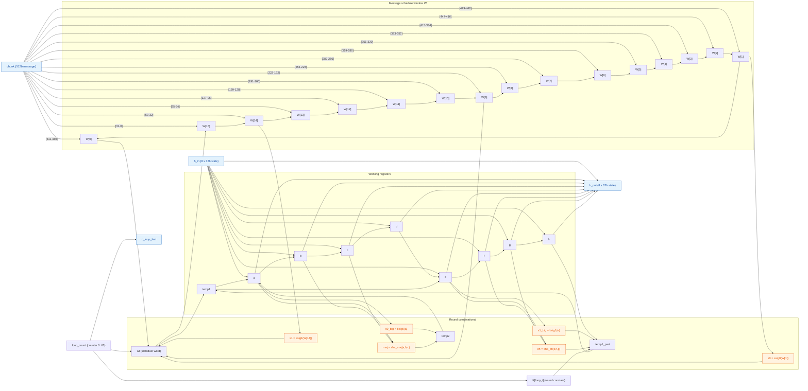

```mermaid
flowchart LR

    %% ---- Ports ----
    chunk["chunk (512b message)"]
    h_in["h_in (8 x 32b state)"]
    h_out["h_out (8 x 32b state)"]
    o_loop_last["o_loop_last"]

    %% ---- Round index ----
    loop_count["loop_count (counter 0..63)"]
    K["K[loop_i] (round constant)"]

    %% ---- Message schedule sliding window ----
    subgraph SCHED["Message schedule window W"]
        W0["W[0]"]
        W1["W[1]"]
        W2["W[2]"]
        W3["W[3]"]
        W4["W[4]"]
        W5["W[5]"]
        W6["W[6]"]
        W7["W[7]"]
        W8["W[8]"]
        W9["W[9]"]
        W10["W[10]"]
        W11["W[11]"]
        W12["W[12]"]
        W13["W[13]"]
        W14["W[14]"]
        W15["W[15]"]
    end

    %% ---- Combinational round helpers ----
    subgraph COMB["Round combinational"]
        s0["s0 = ssig0(W[1])"]
        s1["s1 = ssig1(W[14])"]
        s0b["s0_big = bsig0(a)"]
        s1b["s1_big = bsig1(e)"]
        chN["ch = sha_ch(e,f,g)"]
        majN["maj = sha_maj(a,b,c)"]
        wt["wt (schedule word)"]
        temp1_part["temp1_part"]
        temp2["temp2"]
    end

    %% ---- Working registers + temp1 ----
    subgraph WORK["Working registers"]
        temp1["temp1"]
        ra["a"]
        rb["b"]
        rc["c"]
        rd["d"]
        re["e"]
        rf["f"]
        rg["g"]
        rh["h"]
    end

    %% ---- Counter ----
    loop_count --> o_loop_last

    %% ---- Window load ----
    chunk -->|"[511-480]"| W0
    chunk -->|"[479-448]"| W1
    chunk -->|"[447-416]"| W2
    chunk -->|"[415-384]"| W3
    chunk -->|"[383-352]"| W4
    chunk -->|"[351-320]"| W5
    chunk -->|"[319-288]"| W6
    chunk -->|"[287-256]"| W7
    chunk -->|"[255-224]"| W8
    chunk -->|"[223-192]"| W9
    chunk -->|"[191-160]"| W10
    chunk -->|"[159-128]"| W11
    chunk -->|"[127-96]"| W12
    chunk -->|"[95-64]"| W13
    chunk -->|"[63-32]"| W14
    chunk -->|"[31-0]"| W15

    %% ---- Window shift ----
    W1 --> W0
    W2 --> W1
    W3 --> W2
    W4 --> W3
    W5 --> W4
    W6 --> W5
    W7 --> W6
    W8 --> W7
    W9 --> W8
    W10 --> W9
    W11 --> W10
    W12 --> W11
    W13 --> W12
    W14 --> W13
    W15 --> W14
    wt  --> W15

    %% ---- Combinational sources ----
    W1 --> s0
    W14 --> s1
    ra --> s0b
    re --> s1b
    re --> chN
    rf --> chN
    rg --> chN
    ra --> majN
    rb --> majN
    rc --> majN

    %% ---- wt ----
    W0 --> wt
    loop_count --> wt
    s0 --> wt
    W9 --> wt
    s1 --> wt

    %% ---- temp1_part and temp2 ----
    rh --> temp1_part
    s1b --> temp1_part
    chN --> temp1_part
    loop_count --> K
    K --> temp1_part
    s0b --> temp2
    majN --> temp2

    %% ---- temp1 ----
    temp1_part --> temp1
    wt --> temp1

    %% ---- State init ----
    h_in --> ra
    h_in --> rb
    h_in --> rc
    h_in --> rd
    h_in --> re
    h_in --> rf
    h_in --> rg
    h_in --> rh

    %% ---- Register rotation ----
    temp1 --> ra
    temp2 --> ra
    ra --> rb
    rb --> rc
    rc --> rd
    rd --> re
    temp1 --> re
    re --> rf
    rf --> rg
    rg --> rh

    %% ---- Final hash add ----
    h_in --> h_out
    ra --> h_out
    rb --> h_out
    rc --> h_out
    rd --> h_out
    re --> h_out
    rf --> h_out
    rg --> h_out
    rh --> h_out

    classDef port fill:#e3f2fd,stroke:#1565c0,color:#0d47a1;
    classDef comb fill:#fff3e0,stroke:#e65100,color:#e65100;
    class chunk,h_in,h_out,o_loop_last port;
    class s0,s1,s0b,s1b,chN,majN comb;
```
